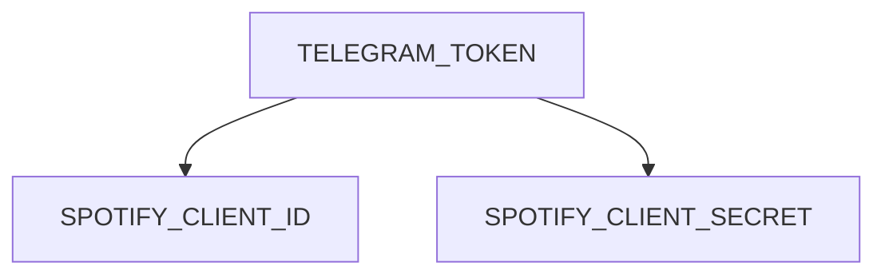

# MUSIC AND VIDEO DOWNLOADER TELEGRAM BOT
Create New :
> .env


Add new:
 ```
TELEGRAM_TOKEN
```
 ```
SPOTIFY_CLIENT_ID
```
```
SPOTIFY_CLIENT_SECRET
```
| Environment | Description |
| --- | --- |
| TELEGRAM_TOKEN | You need to write the token you got from @Botfather|
| SPOTIFY_CLIENT_ID |You need to write the api you got from https://developer.spotify.com/|
| SPOTIFY_CLIENT_SECRET|You need to write the api you got from https://developer.spotify.com/|

Here is a simple flow chart:

